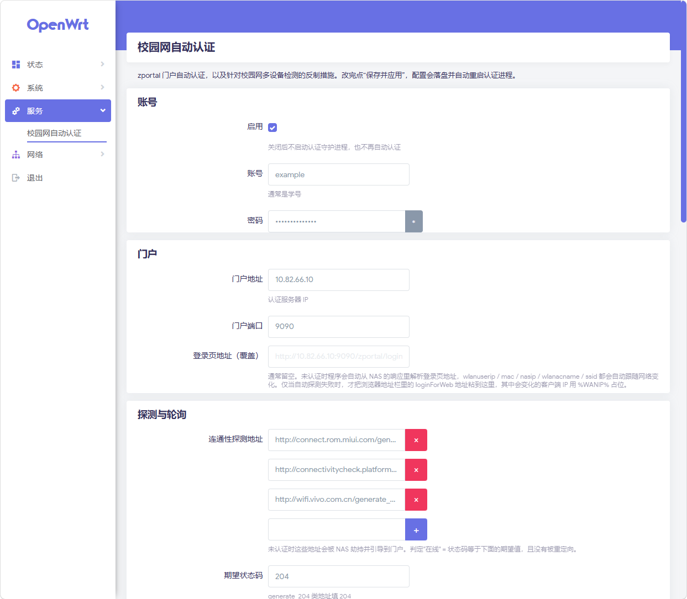

# autoverify

[](https://github.com/RealCaCl2/autoverify/actions/workflows/ci.yml)
[](LICENSE)

校园网门户（**卓智**）的 OpenWrt 自动认证程序，含 LuCI 设置页面。

纯 POSIX sh 实现，无编译依赖，运行时仅需 `curl`。断线自动重认证，出口接口 up 时立即认证。

> 本项目不限定于特定学校，目前已在淮安大学校园网完成实测验证。
> 门户地址由响应中的 `/zportal/` 自动识别，多数 zportal 学校无需修改代码。

---

## 使用须知

- 本项目**仅实现认证自动化**。校园网通常按 IP 计会话，路由器 NAT 后方的多台设备共用
  同一个已认证 IP，该行为在**多数学校的用户协议中属于明确禁止项**。
- `autoverify-hardening`（TTL 归一化 / NTP 收敛 / DNS 收敛）属于**主动对抗多设备检测**
  的措施，使用它**可能违反所在学校的网络使用规定**，后果由使用者自行承担。
- 上述措施**均可被绕过，且不保证有效**。其原理与自检方法见
  [docs/detection.md](docs/detection.md)。
- **请仅在具有使用权的账号与网络上运行本程序。**
- 作者不对使用本项目所产生的任何后果承担责任。

---

## 背景

校园网出口按 **IP** 绑定会话。路由器接入校园网后获得一个 `10.80.x.x` 地址，
必须有设备完成门户认证，该出口才能通信。本程序运行在路由器上，代替该出口完成认证：

```
校园网 ── WAN(10.80.x.x) ── [OpenWrt + autoverify] ── LAN(192.168.1.0/24) ── 客户端设备
                                     ↑ 认证的是这个 IP
```

协议细节（NAS 为何返回 200、隐藏字段的形式、为何必须跟随跳转）见
**[docs/protocol.md](docs/protocol.md)**。

---

## 适配其他学校

多数 **zportal**（卓智）学校无需额外配置即可使用：

- 门户地址不写死：由响应中的 `/zportal/` 自动识别（`portal.host` 留空即可）
- `wlanuserip` / `mac` / `nasip` / `wlanacname` / `ssid` 均从 NAS 响应中实时提取，
  更换网络、设备或 AP 均无需修改配置
- 隐藏字段在每次认证前重新抓取登录页回填，**不依赖任何加密算法**，
  门户更换密钥或算法均不受影响

**若无法正常工作，建议按以下顺序排查：**

1. 执行 `/usr/sbin/autoverify debug`，查看探测结果、识别出的门户地址与解析到的字段
   （LuCI 页面上有对应按钮）。
2. **门户不是 zportal**（如 `srun_portal_pc`、Dr.COM、锐捷 ePortal）：本项目不适用，
   需要改写 `find_portal_url` / `do_login`。
3. **门户要求验证码**：本程序无法处理，会明确报错并提示先行手动认证。
4. **门户返回 success 但会话未建立**：参见 [docs/protocol.md](docs/protocol.md) 中关于
   `nextPage` 的说明 —— 仅发送 POST 不够，**必须跟随其返回的跳转**。

完整的协议实测记录（NAS 为何返回 200 而非 302、隐藏字段的形式、`userIndex` 为何按 IP
记账）见 **[docs/protocol.md](docs/protocol.md)**。

## 安装

### 方式一：apk 包（推荐）

从 [Releases](../../releases) 下载 `autoverify-*.apk`（**noarch，架构无关**，任何 OpenWrt
25.x 均可安装），也可自行构建（见下文）。

```sh
# 1. 路由器上先安装 curl
apk update && apk add curl

# 2. 上传 apk。
#    OpenWrt 的 dropbear 不包含 sftp-server，新版 scp 默认走 SFTP 会失败，改用管道传输：
cat autoverify-*.apk | ssh root@192.168.1.1 'cat > /tmp/autoverify.apk'

# 3. 安装。包未使用 OpenWrt 官方密钥签名，因此需要 --allow-untrusted
ssh root@192.168.1.1
apk add --allow-untrusted /tmp/autoverify.apk && rm /tmp/autoverify.apk
```

安装完成后，在 LuCI 中进入 **服务 → 校园网自动认证**。

> apk 的 conffile 机制：当 `/etc/config/autoverify` 已存在且与包内默认值不同时，
> 现有配置会被保留，包内默认值另存为 `/etc/config/autoverify.apk-new`，**密码不会丢失**。

### 方式二：手动部署文件（不使用包管理器）

```sh
tar cz -C files . | ssh root@192.168.1.1 'tar xz -C /'
ssh root@192.168.1.1 '
  chmod +x /usr/sbin/autoverify /usr/sbin/autoverify-apply /usr/sbin/autoverify-hardening \
           /etc/init.d/autoverify /etc/hotplug.d/iface/99-autoverify /etc/uci-defaults/90-autoverify-migrate
  chmod 600 /etc/config/autoverify
'
```

### 从源码构建 apk

apk 包是 apk-tools 3.x 的 **ADB 二进制格式**（文件头 `ADBd`），其 schema 仅有松散定义、
实际取决于 apk-tools 的 C 源码，**无法手工拼装**，必须使用 OpenWrt SDK。

```sh
# 在 WSL / Linux 中执行（需要 build-essential / unzip / zstd / flex / bison / libncurses-dev）
bash tools/build-apk.sh
# 产物输出到 dist/
```

脚本会自动下载 SDK。**默认使用 USTC 镜像** —— `downloads.openwrt.org` 在国内通常仅有
100KB/s 量级，而 SDK 超过 200MB，下载耗时很长（实测 135KB/s，镜像 1.3MB/s）。
可通过 `MIRROR=` 覆盖，或改为 `https://mirror.sjtu.edu.cn/openwrt`。

## 配置

配置存放在 **UCI**：`/etc/config/autoverify`。

### 使用 LuCI（推荐）

进入 **服务 → 校园网自动认证**。各分组对应 UCI 中的同名 section。
修改后点击“保存并应用”，将自动提交配置、重新应用加固规则并重启认证进程。

### 使用命令行

```sh
uci set autoverify.main.username='你的学号'
uci set autoverify.main.password='你的密码'
uci commit autoverify
/etc/init.d/autoverify reload
```

### 配置项

| section | option | 说明 |
|---|---|---|
| `main` | `enabled` / `username` / `password` | 开关与账号 |
| `portal` | `host` / `port` / `url` | 门户地址 |
| `tuning` | `probe_urls` / `expect_code` / `http_timeout` / `check_interval` / `retry_interval` / `max_retry_interval` / `verbose` | 探测与轮询 |
| `network` | `wan_if` / `hotplug_if` / `lan_dev` | 接口 |
| `ttl` / `ntp` / `dns` | `enabled` 等 | 反检测措施，见 **[docs/hardening.md](docs/hardening.md)** |

**`portal.url` 通常留空。** 未认证时程序会自动从 NAS 响应中解析登录页地址，
`wlanuserip` / `mac` / `nasip` / `wlanacname` / `ssid` 均自动跟随网络变化。
仅当自动探测失败时，才需要将浏览器地址栏中的地址粘贴至此，
其中的客户端 IP 用 `%WANIP%` 占位。

## 启动

```sh
/etc/init.d/autoverify enable
/etc/init.d/autoverify start
logread -f -e autoverify     # Ctrl-C 退出
```

## 验证

### LuCI 页面中的“操作”区

共四个按钮：**立即认证一次** / **检测连通性** / **查看加固状态**，
以及一个只读的 **将要提交的认证字段**。输出与退出码均以弹窗显示。

### 命令行

```sh
/usr/sbin/autoverify debug              # 只读: 打印配置/连通性/待提交字段，不提交认证
/usr/sbin/autoverify check; echo $?     # 0=在线 1=离线
/usr/sbin/autoverify once               # 检测后按需认证一次
/usr/sbin/autoverify -v once            # 输出详细日志
/usr/sbin/autoverify update-check       # 0=已是最新 1=有新版本 2=查询失败
/usr/sbin/autoverify-hardening status   # 加固措施开关 + 系统实际状态
```

`update-check` 查 GitHub Releases 并与本机包版本比对，**只读**：不下载、不安装、
不改任何配置。比对用的是 Release 里 apk 资产名中的版本号（与包版本同一套编号），
而不是 tag —— 两者并不对应（如 tag `v1.0.2` 对应包版本 `1.0.0-r7`），
拿 tag 比会永远报“有新版本”。

查询走 GitHub API，未认证时限流 **60 次/小时/IP**，手动点一下完全够用。
https 不通或仓库无 Release 时会明确报错并返回 2。

`-v` 必须以参数形式传入：UCI 是唯一事实来源，环境变量仅在不存在 `uci` 命令时作为回退，
因此在路由器上 `VERBOSE=1 autoverify once` 不会生效。

`debug` 输出示例：

```
== 配置 ==
  来源            : UCI /etc/config/autoverify
  账号            : 20230001
  探测地址        : http://connect.rom.miui.com/generate_204 ...
  WAN 接口        : phy1-sta0
  该接口 IP       : 10.80.3.64
  该接口 MAC      : AABB-CCDD-EEFF
== 连通性 ==
  离线 (需要认证)
== 认证页与字段 ==
  提交地址: http://10.82.66.10:9090/zportal/login/do
  提交字段:
    qrCodeId=请输入编号
    username=20230001
    pwd=***
    ...
```

## LuCI 设置页面

菜单：**服务 → 校园网自动认证**（`/cgi-bin/luci/admin/services/autoverify`）。



页面分七组配置（每组对应 UCI 里的一个 section），外加一个操作区：

| 分组 | 内容 |
|---|---|
| 账号 | 启用开关、账号、密码 |
| 门户 | 门户地址 / 端口 / 登录页地址覆盖 |
| 探测与轮询 | 探测地址（可增删多条）、期望状态码、各类超时与间隔 |
| 接口 | 出口 netdev、hotplug 接口、LAN 接口 |
| TTL 归一化 | 开关 + TTL 值（64 / 128 下拉选择） |
| NTP 收敛 | 开关 + 上游服务器列表 |
| DNS 收敛 | 开关 |
| 操作 | 立即认证一次 / 检测连通性 / 查看加固状态 / 检查更新 / 将要提交的认证字段（输出+退出码弹窗） |

四个按钮均以 `-v` 调用并显示退出码：`autoverify check` / `once` **在正常情况下不产生
任何输出**（仅以退出码表示结果），仅捕获 stdout 会得到空弹窗，无法区分成功、离线
与权限被拒。

ACL 中**未授予 `autoverify login` 的执行权限** —— 该子命令会在已在线时强制重新认证，
导致自身会话被顶掉。

点击“保存并应用”后依次执行：`uci commit autoverify` → procd 的 reload trigger 触发
`/etc/init.d/autoverify reload` → 重新应用加固规则并重启认证进程。
页面本身无需执行任何“应用”脚本。

涉及文件：

```
www/luci-static/resources/view/autoverify.js      视图
usr/share/luci/menu.d/luci-app-autoverify.json   菜单
usr/share/rpcd/acl.d/luci-app-autoverify.json    权限(uci 读写 + 三条命令的 exec)
```

## 运行机制

| 组件 | 作用 |
|---|---|
| `/etc/init.d/autoverify` | procd 服务，开机自启，进程异常自动拉起 |
| `/usr/sbin/autoverify daemon` | 每 `CHECK_INTERVAL`(60s) 探测一次，掉线即重新认证 |
| `/etc/hotplug.d/iface/99-autoverify` | 出口接口 up 时立即认证一次，不等待轮询 |

三项反检测措施（TTL 归一化 / NTP 收敛 / DNS 收敛）由 `autoverify-hardening` 控制，
**开机时由 init 脚本自动从 UCI 应用**，不随认证进程一起运行。
详见 **[docs/hardening.md](docs/hardening.md)**。

`daemon` 的等待采用“后台 sleep + wait”而非前台 `sleep`。busybox ash 需等待前台
子进程结束后才会处理 trap；若直接前台执行 `sleep 300`，`/etc/init.d/autoverify stop`
会一直阻塞至 procd 超时后 SIGKILL，而这段时间内 `start` 已经执行，导致
**两个 daemon 同时发起认证请求**。

两个接口配置项分属不同命名空间，注意区分：

- `WAN_IF` 是 **netdev** 名（如 `phy1-sta0`），用于读取 IP 与 MAC，留空则自动探测。
- `HOTPLUG_IF` 是 **netifd 接口名**（如 `wwan` / `wan`），用于决定热插拔是否触发。

认证失败时的重试间隔按 `20s → 40s → 80s → …` 退避，上限为 `MAX_RETRY_INTERVAL`(300s)，
以避免高频失败触发门户的失败计数限制而强制要求验证码。

---

## 测试

不需要连真实校园网，用内置的 mock 门户做端到端回归：

```sh
sh test/run.sh          # 需要 python3 + curl
```

共 10 个用例，覆盖：认证成功、密码错误、重复认证、门户要求验证码、门户返回非 JSON、
未认证时回 200 并页面内跳转、未认证时回 200 并带 Location、完全找不到门户地址、
跨两跳重定向取得登录页，以及 **`portal.host` 留空（即开源后的默认配置）**。

其中“认证成功”与“空 `portal.host`”两个用例会卡住一个关键回归点：
门户**必须在跟随 `nextPage`（`goToAuthResult`）之后才会真正授权** ——
mock 仅在 `goToAuthResult` 被请求后才返回 204。

“空 `portal.host`”用例还额外覆盖另一个真实缺陷：shell 的 `case` 语句中 `*""*`
会匹配任意字符串，若不对空值做判断，**任何 URL 都会被误判为门户**。

---

## 相关项目

本项目的加固措施覆盖 **L3 / L4**（TTL、NTP、DNS）。**明文 HTTP 的 User-Agent** 属于 L7，
本项目不处理。如需覆盖该维度，可使用 [UA-Mask](https://github.com/Zesuy/UA-Mask)。

> **但本项目自己的出站 UA 是伪装的。**探测走的是明文 HTTP，校园网 DPI 直接看得见，
> 所以 `tuning.user_agent` 默认是一个真实的当前主流 Chrome UA。
> 它与 UA-Mask 的 `UAmask.main.ua` **应当保持一致** —— 探测流量和 NAT 后的客户端流量
> 同源同 IP，两边 UA 不同本身就等于告诉对面：这台机器上住着两种浏览器。

两者职责不重叠，可以并用：

| 层 | 组件 |
|---|---|
| L3 TTL | `autoverify-hardening ttl` |
| L4 NTP / DNS | `autoverify-hardening ntp` / `dns` |
| L7 HTTP UA | UA-Mask（外部项目） |

**并用时的交互**（以下结论来自对其 `init.d/UAmask` 源码与本项目实际规则的比对，
**未在本环境实测**，启用前建议自行验证）：

- **TCP 会先被 UA-Mask 截走。**其入站链声明为
  `type nat hook prerouting priority dstnat - 1`，**刻意排在 fw4 的 `dstnat` 链之前**，
  因此优先于本项目 `dns-converge-*` / `ntp-converge` 所用的 UCI `redirect` 规则。
- **只有 TCP 受影响。**它的规则只匹配 `ip protocol tcp`，所以
  `ntp-converge`（udp/123）与 `dns-converge-udp`（udp/53）不受影响。
- **实际受影响的是“发往非局域网服务器的 TCP DNS”。**它的规则带
  `ip daddr != { bypass_ips }`（默认含局域网）与 `tcp dport != { 22 443 }`，
  所以查询路由器自身（`192.168.1.1`）会被豁免；仅当 `tcp/53` 指向外部解析器时
  才会被重定向进代理，从而绕过本项目的 DNS 收敛。
  **建议把 `53` 加入它的 `bypass_ports`。**
- **防火墙规则互不覆盖。**本项目用 UCI `redirect` 段，它用 UCI `include` 段
  （`firewall.UAmask`），其卸载逻辑只删除自身那一段，因此双方的 `fw4 reload`
  不会清掉对方。
- **启动顺序值得留意。**本项目 `START=95`，UA-Mask `START=99`，即本项目的
  `autoverify-apply` 会先执行一次 `fw4 reload`；而它的 include 指向
  `/tmp/UAmask_rules.nft`。正常关机时该段会被清除，但**异常断电可能残留
  指向缺失文件的 include 段**。

> **许可证注意**：UA-Mask 采用 **GPL-3.0**，与本项目的 MIT **不能合并**。
> 两者只能作为独立软件并存（各自安装）；若确实需要将其实现并入本项目，
> 则本项目必须整体改为 GPL-3.0。

---

## 文档

| 文档 | 内容 |
|---|---|
| [docs/protocol.md](docs/protocol.md) | zportal 协议实测说明（实现依据） |
| [docs/hardening.md](docs/hardening.md) | 反检测加固：TTL / NTP / DNS |
| [docs/detection.md](docs/detection.md) | 多设备检测方式清单、证据强度、自检方法 |
| [docs/verification.md](docs/verification.md) | 实测记录 |


## 已知限制

- 门户若要求输入**验证码**，本程序无法处理，会明确报错并提示先行手动认证。
- 门户页面结构变更（字段改名或改 id）会导致报错 `认证页缺少字段: ...`，
  需要同步更新 `LOGIN_FIELDS`。
- 若 NAS 换用其他方式引导客户端到门户，会报错 `未发现门户重定向` 并附带响应头与响应体，
  可据此在 `find_portal_url` 中补充一种识别方式。
- 仅支持明文 HTTP。若门户改为 HTTPS 或改用其他认证协议（如 `srun_portal_pc`），需要重写。
- 账号密码以明文形式存放在 `/etc/config/autoverify`（权限 600，UCI 格式）。OpenWrt 上做
  本地加密意义有限，但请知悉这一点，**请勿将该文件提交至任何仓库**。

## 附：在 Windows/MSYS 上运行测试的注意事项

git-bash 中的 `curl` 是 Windows 原生二进制，**其 argv 会从 UTF-8 重新编码为当前代码页
（中文系统上为 GBK）**。因此 `test/run.sh` 对 `qrCodeId` / `validCode` 仅断言
“字段存在且非空”，不比较具体字节。路由器上的 curl 是原生 Linux 二进制，argv 为裸字节，
不存在该问题（已在路由器上用 `hexdump -C` 逐字节确认）。
